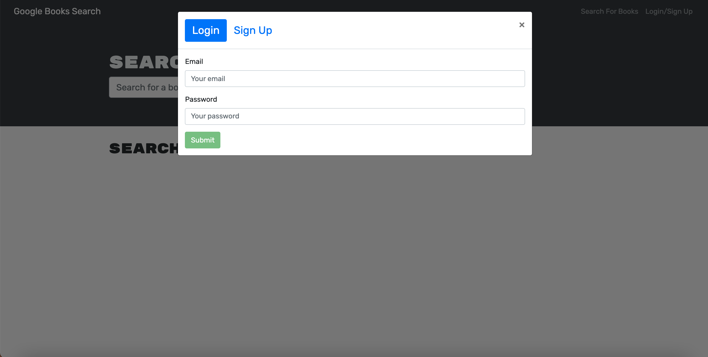
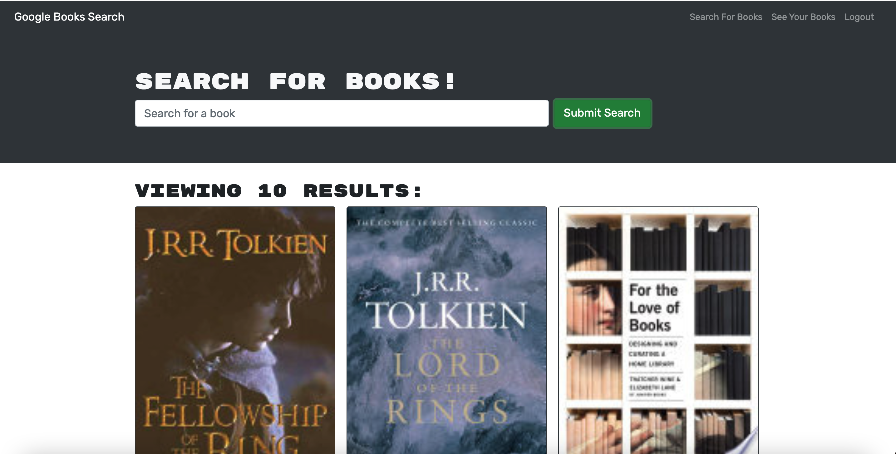

# Book Search Engine
    
## Table of Contents
* [Description](#description) 
* [Installation](#installation)
* [Usage](#usage)
* [Credits](#credits)
* [License](#license)
* [Badge](#badge)
* [Questions](#questions)
    
## Description
* online web search for books and similar titles
    
## Installation
* no installation necessary.  Online search website for books using google API.
    
## Usage
* Instruction for ease of use.  go to website and log in to save your searches and search for your favorite books.
    
    
## Credits
* N/A
    
## License
* Licensed by mit
    
## Badge
* 
    
## Questions
* For any questions, concerns, or additional help, please contact klucas72@hotmail.com.